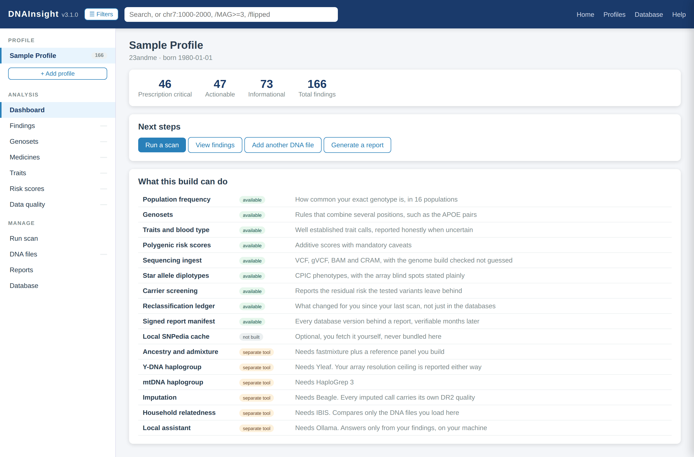

DNAInsight v3.1.0




Personal DNA analysis that runs entirely on your own computer. Read your raw DNA
file from any major provider, annotate it against curated clinical evidence,
explore the results with real filters, and generate reports you can print, keep
or hand to a clinician.

Nothing leaves your machine unless you explicitly ask it to.

**Annotation sources.** DNAInsight annotates against CPIC, ClinVar, gnomAD,
1000 Genomes and the GWAS Catalog, with the PGS Catalog for polygenic scores.
PharmGKB and ClinPGx are used for nothing, deliberately: their data use
agreement adds a no-sale term that CC-BY-SA-4.0 does not carry, which would
strip commercial use from everyone downstream. Any description of this project
claiming PharmGKB annotation is wrong. `data/DATA_SOURCES.md` section 9 records
that exclusion as a decision rather than an oversight.

---

What is new in v3.1

v3.0 added the capabilities. v3.1 is about the two places a user meets this
project first, and both were quietly lying.

**The installers claimed success without checking anything.** Both now run a
fifth step that imports the backend, builds the Flask app and parses the
bundled reference before printing the completion banner. Building the app is
the part that matters: a missing data file or a broken blueprint surfaces
there and nowhere earlier. A failure is fatal and prints the command that
shows the real error.

`tests/test_install_scripts.py` holds them to it. Every path either script
references must exist, the two must stay in step with each other, step
counters must be contiguous, and the same three checks the installers run are
executed in-process. All static, so a Linux runner can test the Windows batch
file.

Running install.bat rather than reading it turned up two bugs that shipped in
v1 and v2. An unescaped `>` in an echo was a redirect, so every Windows install
directory received a stray file literally named `Database` containing half a
sentence. And the completion banner lost its exclamation mark to delayed
expansion. Both are fixed and three tests now guard the class rather than the
two instances.

**The dashboard advertised the wrong product.** The capability table was
hardcoded to the five v2 subsystems, so a v3 build showed none of its own work.
It now lists all sixteen with three states instead of two: available, not
built, and needs a separate tool. Collapsing the last two would send somebody
looking for a builder that does not exist for that feature, which is the same
not-found versus never-checked distinction the genoset engine already draws.

Also in this release: `pytest<9.0` in the dev requirements failed on any
current environment and had done since before v3.0, so a clean checkout could
not pass its own release gate; flake8 was commented out as optional while both
CI and the gate require it. Both fixed. The screenshot is a real capture of a
running instance against a 640,000 marker export, palettised from 425 KB to
156 KB, and carries no personal data.

---

What is new in v3.0

v2.0 told you what a variant means for you and ranked it. v3.0 tells you when
that meaning CHANGES, where your data runs out, and what it could not check.

| Capability | v2.0 | v3.0 |
|---|---|---|
| Reclassification | none, every scan stood alone | change ledger, 15 change kinds, dated additive addenda |
| Provenance | none | signed reproducible manifests, plus a runtime audit of the bundling rule |
| Input formats | consumer array exports | plus VCF, gVCF, BAM and CRAM, with the genome build detected from contig lengths and mismatches refused |
| Ancestry | none | global proportions, local ancestry, chromosome painting, published panel manifest |
| Haplogroups | none | bundled Y and mtDNA backbones, with three optional tools for depth |
| Relatives | trio checks on loaded files | IBD across loaded kits, relationship ranges, parental phasing, chromosome browser |
| Imputation | none | DR2 as a first-class field, imputed calls structurally capped below typed ones |
| Pharmacogenomics | CPIC level per variant | star-allele diplotypes for 9 genes, Indeterminate by default, prescription guard |
| Carrier screening | risk allele per variant | 11-gene panel with residual risk arithmetic and joint reproductive risk |
| Assistant | none | grounded local model, refusal-first, genotypes never leave the process |
| External tools | none | 11 adapters behind a licence gate, 5 permanently blocked with named replacements |
| Endpoints | 20 v2 | plus 31 v3 paths |
| Tests | 1929 | 3267 |

---

Six features need a tool you install yourself

Ancestry, local ancestry, imputation, Y haplogroup depth, mtDNA haplogroup depth
and the assistant all depend on third-party programs. DNAInsight cannot bundle
them: the best available tools are GPL-3.0, and vendoring one would relicense
this repository by copyleft. So DNAInsight ships only the adapter, which is MIT,
and the tool is installed by you into `~/.dnainsight/tools/` on explicit
consent. **The subprocess boundary is the licence boundary.** No external tool
is imported, linked or vendored.

Until you install one, the capability reports `available: false` and
`not_attempted: true`, the UI hides the control, and nothing pretends to have
run. "We looked and found nothing" and "we could not look at all" are different
claims and this project never collapses them.

| Feature | Needs | Licence | Without it |
|---|---|---|---|
| Global ancestry | fastmixture plus a built panel | GPL-3.0 | not attempted |
| Local ancestry and painting | FLARE plus phased input | Apache-2.0 | not attempted |
| Imputation | Beagle 5.5 plus a built panel | GPL-3.0-or-later | not attempted |
| Y haplogroup depth | Yleaf, optionally Clade Finder | GPL-3.0, MIT | bundled backbone call only, flagged provisional |
| mtDNA haplogroup depth | HaploGrep 3 | MIT | bundled backbone call only, flagged provisional |
| BAM and CRAM ingest | samtools | MIT | VCF and gVCF still work |
| Phasing | SHAPEIT5 or Beagle | MIT, GPL-3.0 | not attempted |
| Unphased IBD | none, pure Python; IBIS optional | GPL-3.0 | works |
| Assistant | Ollama plus a local model | MIT | refuses |

Five tools are **permanently blocked and cannot be installed even on consent**,
each with a recorded reason and a replacement: ADMIXTURE, RFMix v2, yhaplo,
yallHap, and DIYDodecad with the Eurogenes, Dodecad, MDLP and HarappaWorld
model files. `docs/EXTERNAL_TOOLS.md` is the architecture and the install guide.

---

What v3.0 has not verified

`docs/KNOWN_GAPS.md` lists every figure in this release that was not
machine-checked at source, and it is the most important document here.
Everything in it is shipped and working. That is exactly why it is written down.

Short version: all 49 bundled Y markers are unverified, 15 of the 28 mtDNA
nodes carry no verified defining position, 17 star alleles are unverified with
3 in direct conflict with CPIC's own tables, 22 of 23 carrier variant mappings
and all 25 carrier frequencies are unverified, and no external tool's
command-line arguments have been executed against an installed binary. One defect is open and named:
`data/evidence_overlay.py` files rs28371706 under CYP2C9 while the same rsID is
widely reported as the CYP2D6\*17 defining variant. Both cannot be right.

A figure nobody re-verifies drifts. A tool that hides its unverified figures is
worse than one that lists them.

---

What was new in v2.0

v1.x told you what a position meant. v2.0 tells you what it means FOR YOU, ranks
it, and is honest about what it cannot establish.

| Capability | v1.2 | v2.0 |
|---|---|---|
| Interest ranking | none, every finding looked equal | DNAInsight magnitude, 0 to 10, with a per-finding audit trail |
| Direction of effect | none | repute: good, bad, or deliberately unset |
| Carrier awareness | online API only | offline too, from a bundled risk allele per variant |
| Multi-SNP rules | none | 65 genosets with a full boolean criteria engine |
| Population frequency | none | 16 populations, your exact genotype, observed or Hardy-Weinberg |
| Strand handling | none | full reconciliation, with unverifiable sites flagged not guessed |
| Multiple DNA files | one per profile | pool several, keep disagreements, compare relatives |
| Polygenic scores | none | 7 models with mandatory caveats and coverage honesty |
| Traits and blood type | none | 18 traits plus ABO and RhD, refusing to guess when uncertain |
| Filtering | search box and a gene dropdown | server-side engine, sliders, facets, 20 sort orders, query grammar |
| Reports | 2 static | 3, including a self-contained offline interactive report |
| Tests | 138 | 1929 |

---

The honesty features, which are the point

Most consumer DNA tools fail in the same four ways. v2.0 addresses each one
directly, and these behaviours are covered by tests so they cannot regress.

**1. It will not alarm you about a variant you do not carry.**
A ClinVar classification describes an ALLELE, not a position. Showing
"pathogenic" to someone carrying two reference copies is simply wrong, and it is
the most common way these tools frighten people for no reason. Non-carriers are
scored down to a quarter, their repute is cleared, and the card says plainly that
you do not carry the reported variant.

**2. It admits when the strand cannot be verified.**
Testing companies report the plus strand of GRCh37. Reference databases sometimes
store the other one. For an A/T or C/G genotype, complementing gives you the
other allele you already have, so no metadata can settle which reading is right.
Those sites are capped at magnitude 2, badged "strand ambiguous", and explained.
13 of the 122 bundled variants are affected.

**3. It distinguishes "not present" from "never checked".**
A genoset is a rule over several positions. If your array did not read one of
them, the rule cannot be evaluated at all. Those appear in a separate section
headed "not testable on your array", never mixed in with rules that were checked
and found absent.

**4. It never labels a trait good or bad.**
Traits and polygenic scores always render neutral grey. Eye colour is not a
verdict. A no-call scores exactly zero, because a failed probe is not a finding.

v3.0 adds four more, on the same terms.

**5. An imputed genotype can never outrank a measured one.**
Imputation predicts calls your array never read. Every imputed call carries its
DR2, is capped at magnitude 3.0 below the quality threshold, and ceilings at 9.5
even when perfect, against a typed ceiling of 10.0. The cap is written into the
magnitude audit trail as a named step, including when it did not bind. A test
asserts the parity gap, so it is a structural guarantee rather than a habit.

**6. A pharmacogenomic result defaults to Indeterminate, not Normal.**
An array that never read the position defining CYP2C19\*2 has not shown \*2 is
absent. Calling that \*1/\*1 is the most dangerous thing a consumer
pharmacogenomics tool can do. The cost of Indeterminate is a user who has to ask
a pharmacist. The cost of a wrong Normal is a user who does not.

**7. It will not say "not a carrier".**
The phrase is forbidden in code, along with "non-carrier", "no risk" and "rules
out". The answer is always "not a carrier for the N variants tested", where N is
what your file could actually read, and it comes with the residual risk
arithmetic. Where the detection rate for your population is unknown, the residual
risk is None with a reason rather than a borrowed number.

**8. A population it cannot resolve is NOT RESOLVABLE, never zero percent.**
Zero percent is a measurement: it says we looked and found none. Not resolvable
says we could not look. Reporting one as the other is how ancestry products turn
a model artefact into an apparent fact about a person.

---

Why the magnitude is not the SNPedia magnitude

SNPedia's Magnitude and Repute are hand-curated by wiki editors and licensed
CC-BY-NC-SA-3.0-US. Redistributing them would force this repository to
non-commercial share-alike. So DNAInsight computes its own from CC0 and public
domain evidence: CPIC guideline level, ClinVar review status, replicated GWAS
support, publication counts, population frequency and your carrier status.

The 0 to 10 shape is intentional, so anyone who has read a Promethease report can
read this one. The numbers are not the same, and the interface says so.

Every card can expand to show exactly how its number was produced, step by step.
An opaque interest score would be worse than none.

If you want the real SNPedia values, the Database view has an opt-in fetch that
runs on your machine and writes to `~/.dnainsight/`, outside this project folder.
It is licence-gated and refuses to run until you accept the terms. Nothing it
downloads is ever committed. See `data/DATA_SOURCES.md`.

---

Supported DNA providers

| Provider | Format | Notes |
|---|---|---|
| AncestryDNA | .txt tab-delimited | V1 and V2 arrays |
| 23andMe | .txt tab-delimited | all array versions |
| MyHeritage | .csv or .txt | |
| FamilyTreeDNA | .csv | the SNP test, not the STR test |
| LivingDNA | .txt | |
| Generic TSV | .txt / .csv | auto-detected column layout |

Upload the uncompressed file. Extract the zip from your provider first.

New in v3.0, sequencing files:

| Format | Notes |
|---|---|
| VCF, gVCF | plain or gzipped, read by streaming |
| BAM, CRAM | targeted pileup at the reference positions only, needs samtools |

Genome build is detected from contig LENGTHS, the one header field that cannot
quietly disagree with the coordinates in the body of the file. A build that is
not GRCh37 is refused with a 422 rather than annotated, because mixing builds is
the most common way this class of tool produces confidently wrong answers. Lift
the file over first, or rebuild the reference against your build. Coordinates are
never translated silently.

---

Requirements

- Python 3.10 or newer
- About 60 MB of disk space
- Internet optional. Everything core works offline.

Two dependencies, Flask and requests. No compiler, no scientific stack, no
database server.

Optional, and only for the features that need them:

- A Java runtime, for Beagle, FLARE, hap-ibd and HaploGrep 3
- A reference panel built by `data/build_panel.py`, which is tens of GB
- Whatever else the tool you chose requires

The application itself never downloads any of this. `docs/EXTERNAL_TOOLS.md`
has the install steps.

---

Install

Windows: double-click `install.bat`
macOS and Linux: `bash install.sh`

Or manually:

```
pip install -r requirements.txt
python app.py
```

DNAInsight opens at http://127.0.0.1:5050 . Press Ctrl+C to stop.

To run the test suite as well:

```
pip install -r requirements.txt -r requirements-dev.txt
python -m pytest tests -q
```

---

Walkthrough

**1. Get your raw data.** AncestryDNA: your name, then DNA, Settings, Download
DNA Data. 23andMe: Tools, Browse Raw Data, Download. MyHeritage: DNA, Manage DNA
Kits, Download. FamilyTreeDNA: myDNA, Chromosome Browser, Download Raw Data.

**2. Add a profile.** Click "+ Add profile", enter your details and upload the
extracted .txt file. DNAInsight reports how many variants it read, typically
600,000 to 700,000.

**3. Run a scan.** Choose which subsystems to include. Everything except the
online API option works with no internet. A scan of the bundled reference is
effectively instant; the optional API pass can take 30 to 60 minutes because it
batches every rsID.

**4. Explore the findings.** Open the Filters panel. Drag the magnitude slider,
untick reputes, pick a gene, change the reference population, or type a query:

```
chr7                 everything on chromosome 7
chr7:1000-2000       a position range
/MAG>=3              magnitude 3 and above
/STARS>=2            ClinVar review stars
/CLNSIG=5,4          pathogenic and likely pathogenic only
/flipped             calls whose alleles were complemented
/ambiguous           calls whose strand cannot be verified
/carrier             variants you actually carry
/imputed             predicted calls, never measured on your array
/typed               measured calls only
/provisional         calls the code itself marks as not yet trustworthy
/dr2>=0.9            imputation quality threshold
```

Escape resets every filter. Ctrl+H opens help. F opens the panel.

**5. Generate reports.**

- **Genetic health report.** For you. Plain language, a glossary, and a clear
  split between what needs a prescriber, what needs a lifestyle change, and what
  is background.
- **Doctor discussion report.** For a clinician. Leads with a prescription
  critical table sorted by CPIC level, groups interactions by drug, states its
  own limitations, and includes an AI analysis prompt block.
- **Interactive offline report.** One HTML file containing the findings AND a
  working filter engine. No server, no internet, no DNAInsight install. It makes
  zero network requests. This is the copy worth keeping.
- **Report addendum.** New in v3.0. Dated, additive, and it never rewrites the
  original. A clinician who acted on the January report has to be able to see
  exactly what the January report said.

**6. Scan again later.** Every scan writes a ledger snapshot. The next one tells
you what changed FOR YOU, not what changed in the databases: a variant of
uncertain significance that became pathogenic and that you carry, a CPIC level
that moved, a finding that became evaluable. Each change names the field, both
values, the direction, and the database releases it moved between.

**7. Ask for a manifest.** `POST /api/profiles/<id>/manifest` emits a signed
record of exactly which database versions and which input file hashes produced
your report, so it can be reproduced or shown to have drifted. The signature is
an HMAC over a key generated on your own machine. It proves the manifest was not
altered after generation here. It is not a public-key attestation and does not
prove authorship to anyone else, and the payload says so.

---

Pooling several DNA files

Different testing chips read different positions, so two files from the same
person cover more together than either alone.

Go to DNA files, add another file, and set the relationship to "Yourself". The
files are pooled.

**Where the two files disagree, both readings are kept and shown side by side.**
Nothing is voted on and no winner is picked, because a disagreement between two
arrays is information about reliability that a silent merge would destroy.

Set any other relationship, such as Mother, and that file is used for comparison
only. It never changes your own calls. With both parents loaded you also get
offspring transmission probability and Mendelian consistency checking.

---

What is in the bundled reference

`data/snp_reference.json`, 122 curated variants, chosen for actionability rather
than count. Each carries a plain-English interpretation plus, new in v2.0, a risk
allele, CPIC level, ClinVar review stars, publication count, topics and
medicines. That evidence layer is what makes ranking and offline carrier
awareness possible.

| Category | Focus | Key genes |
|---|---|---|
| Pharmacogenomics | CPIC-level drug response: warfarin, statins, antidepressants, opioids, thiopurines, fluoropyrimidines | CYP2D6, CYP2C19, CYP2C9, VKORC1, SLCO1B1, TPMT, NUDT15, DPYD, UGT1A1, G6PD |
| Metabolic | obesity, type 2 diabetes, nutrient processing, iron overload | FTO, TCF7L2, PPARG, MTHFR, HFE, SLC30A8, MTNR1B |
| Cardiovascular | clotting, lipids, coronary risk | F5, F2, APOE, LPA, 9p21, APOA5 |
| Inflammation | chronic inflammation, autoimmune susceptibility | IL6, TNFA, IL10, CTLA4, IL6R, ERAP1, HLA-DQA1 |
| Neurological | mood, folate cycle, stress response, neurotransmitters | MTHFR, COMT, BDNF, MAOA, SLC6A4, FKBP5, OXTR |
| Detox | oxidative stress, alcohol, nicotine | GSTP1, SOD2, NQO1, ALDH2, CYP1A2, CHRNA3 |

Coverage: 115 of 122 have a risk allele, 46 have a CPIC assignment of which 24
are Level A, and 118 have population frequencies across 16 populations.

**Want more?** `python data/build_full_reference.py --array-file <your raw file>`
builds a much larger local database from ClinVar, the GWAS Catalog and CPIC,
filtered to the positions your array actually reads. It is gitignored because it
is large and fully reproducible.

---

Privacy

- Your DNA is stored only in `dnainsight.db` on your computer.
- The optional MyVariant.info pass sends rsIDs only. Never genotypes.
- The optional SNPedia harvest sends page titles only, and writes outside this
  folder.
- The interactive report makes no network requests at all.
- Delete a profile and its data goes with it.
- The local assistant talks to a model on loopback or it does not answer.
  Genotypes are stripped before anything leaves the process, and the assembled
  prompt is re-scanned for genotype strings afterward. If any survived, nothing
  is sent.
- External tools run as subprocesses on your machine. DNAInsight never downloads
  one, and the running application makes no network calls at all. The panel and
  allele builders do download, but only when you run them, and both refuse to
  fetch anything until you pass `--accept-terms`.
- Household IBD compares only the kits you loaded. There is no matching
  database, and there is nothing to opt out of.

`.gitignore` blocks `uploads/`, every `.db`, and anything with `snpedia` in its
name, so your genetic data and any non-commercial cache cannot be committed by
accident.

---

Disclaimer

DNAInsight is not a medical device and does not provide medical advice. Consumer
DNA arrays are not clinical-grade tests and cover far less than clinical exome or
genome sequencing, so a negative result here does not rule anything out.

Do not start, stop or change any medication based on this software. Confirm any
significant finding with a clinically validated test and discuss it with a
licensed clinician, pharmacist or genetic counsellor. The American Board of
Genetic Counseling maintains a directory at findageneticcounselor.com .

Three v3.0 features deserve naming individually. **Carrier screening here is not
clinical carrier screening**: anyone making a reproductive decision needs a test
ordered through a clinician, with a stated detection rate. **Pharmacogenomic
diplotypes are not clinical pharmacogenomic testing**, and CYP2D6 in particular
is always provisional because an array cannot see copy number or hybrid alleles.
**Imputed calls are never confirmatory**, whatever their DR2.

For educational and research use only.

---

Project layout

```
dnainsight/
├── app.py                     Flask entry point, initialises the schema
├── requirements.txt           two runtime dependencies
├── requirements-dev.txt       adds pytest
├── backend/
│   ├── parsers.py             provider detection and raw file parsing
│   ├── merge.py               multi-file pooling, conflicts, trio
│   ├── orientation.py         strand reconciliation and ambiguity
│   ├── scanner.py             offline annotation and the API pass
│   ├── frequency.py           population frequency, strand tolerant
│   ├── genosets.py            criteria parser and evaluator
│   ├── traits.py              traits, ABO and RhD
│   ├── prs.py                 polygenic scores
│   ├── snpedia.py             opt-in local cache, licence gated
│   ├── scoring.py             magnitude, repute, confidence
│   ├── pipeline.py            scan orchestrator, correct stage order
│   ├── filters.py             filtering, sorting, faceting
│   ├── database.py            SQLite access
│   ├── routes.py              v1 endpoints, unchanged behaviour
│   ├── routes_v2.py           v2 endpoints
│   ├── genetic_report.py      report for you
│   ├── doctor_report.py       report for a clinician
│   ├── interactive_report.py  self-contained offline report
│   ├── external.py            v3: tool registry, licence gate, subprocess runner
│   ├── ledger.py              v3: reclassification snapshots and addenda
│   ├── provenance.py          v3: source graph, signed manifests, licence audit
│   ├── sequencing.py          v3: VCF, gVCF, BAM, CRAM, build detection, liftover
│   ├── haplogroups.py         v3: Y and mtDNA backbones plus three adapters
│   ├── relatedness.py         v3: IBD, cM estimation, relationship ranges
│   ├── imputation.py          v3: Beagle adapter, DR2, the magnitude cap
│   ├── ancestry.py            v3: global and local ancestry, panel manifest
│   ├── diplotype.py           v3: CPIC star alleles, prescription guard
│   ├── carrier.py             v3: carrier panel, residual risk, ACMG coverage
│   ├── assistant.py           v3: grounded local model, refusal-first
│   └── routes_v3.py           v3 endpoints
├── data/
│   ├── build_reference.py     curated table plus evidence overlay
│   ├── evidence_overlay.py    risk alleles, CPIC levels, stars, publications
│   ├── build_genosets.py      the 65-rule corpus
│   ├── build_frequencies.py   population frequencies from Ensembl
│   ├── build_prs.py           polygenic models, with a licence gate
│   ├── build_full_reference.py  optional large local database
│   ├── build_panel.py         v3: 1000 Genomes plus public-tier SGDP panel
│   ├── build_pgx_alleles.py   v3: CPIC allele tables, reconciled against diplotype.py
│   ├── tools_manifest.json    v3: published mirror of the tool registry
│   └── DATA_SOURCES.md        licence record for every source
├── frontend/index.html        the single page app
├── docs/
│   ├── API_V2.md              the v2 API contract
│   ├── API_V3.md              the v3 API contract
│   ├── EXTERNAL_TOOLS.md      licence architecture and install guide
│   └── KNOWN_GAPS.md          every figure this release did not verify
├── tests/                     3220 tests
└── tools/                     release gate and verification harnesses (dev-only)
```

---

Contributing

Evidence bar for a new variant: CPIC Level A or B, or ClinVar pathogenic at 2
review stars or better, or a GWAS association replicated in two or more
independent studies. It must plausibly be on 23andMe v4/v5 or AncestryDNA v2, and
it needs a plain-English interpretation aimed at a non-expert.

Add the row to `data/build_reference.py`, add its evidence to
`data/evidence_overlay.py` including the risk allele on the GRCh37 plus strand,
then run:

```
python data/build_reference.py
python -m pytest tests -q
```

Before opening a pull request, run the full release gate:

```
python tools/golive.py
```

It rebuilds every derived artifact, audits every source file for duplication,
runs the module smoke tests, the strand regression, the pipeline contract check,
the filter engine check, a 42-endpoint API sweep, the interactive report
verification, the GitHub Actions runtime check, the lint gate, a clean-clone CI
simulation, the harness isolation guard and the full test suite.

`CONTRIBUTING.md` documents the design decisions that should not be quietly
reversed and the data-source parsing traps worth reading before you touch the
reference builders.

**The single most valuable contribution to v3.0 is verification.**
`docs/KNOWN_GAPS.md` lists every unverified figure with the file and the field
it lives in. Confirming one Y marker against ISOGG or YFull, one mtDNA position
against PhyloTree, one star allele against the CPIC allele definition tables, or
one carrier frequency against a citable source, and flipping its `verified` flag,
is worth more than a new feature. Bring the source with the pull request.

Two rules for anyone adding an external tool. It must permit commercial use and
redistribution, or it goes in `BLOCKED` with a reason and a named replacement.
And it is invoked through `external.run` and nowhere else, because that one
function is the licence boundary and it has to stay auditable in one place.

---

License

MIT. The code is freely reusable. Bundled data is CC0 or US public domain, so the
whole repository is redistributable. Per-source licences are recorded in
`data/DATA_SOURCES.md`.

External tools keep their own licences, which attach to your copy of those
programs and not to DNAInsight, because they are installed by you and executed
as separate processes. `docs/EXTERNAL_TOOLS.md` records the licence for each one
and the date it was verified. `GET /api/v3/licence-audit` checks the bundling
rule at runtime, so the document and the code cannot drift apart in silence.
